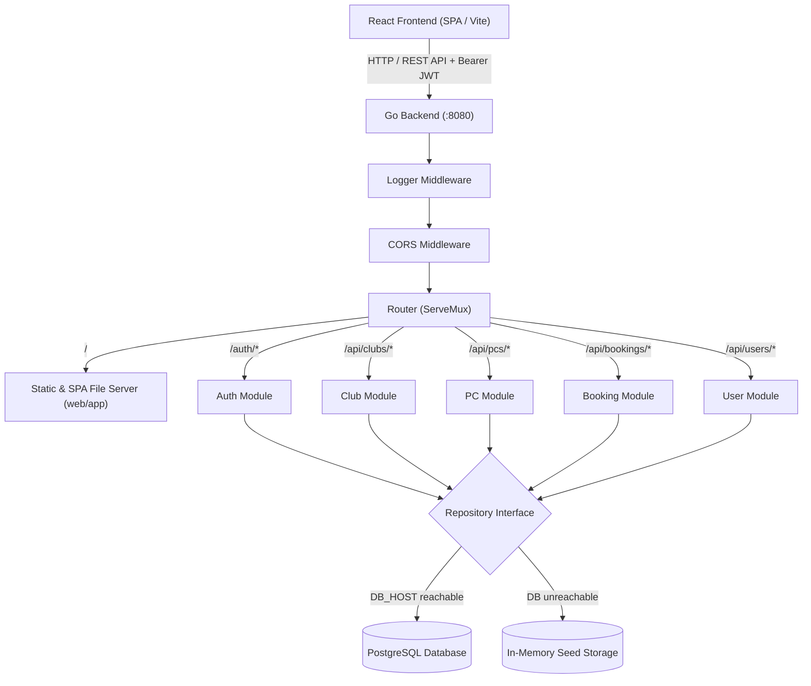

# CyberSlot 🎮
> **Online Gaming PC & Computer Club Booking Platform in Kazakhstan**

[](https://golang.org)
[](https://reactjs.org)
[](https://vitejs.dev)
[](https://redux-toolkit.js.org)
[](https://mapgl.2gis.com)
[](https://www.postgresql.org)

CyberSlot is an end-to-end web platform designed to streamline and automate computer club reservations across Kazakhstan (with initial launch in Astana). Players can explore clubs on an interactive map, inspect hardware specifications across different gaming zones, choose a specific PC, and reserve play sessions online in real time.

---

## 📑 Table of Contents
- [Problem & Solution](#-problem--solution)
- [Key Features](#-key-features)
- [Architecture & Tech Stack](#-architecture--tech-stack)
- [Booking Lifecycle & Conflict Detection](#-booking-lifecycle--conflict-detection)
- [Role-Based Access Control (RBAC)](#-role-based-access-control-rbac)
- [Project Structure](#-project-structure)
- [REST API Reference](#-rest-api-reference)
- [Getting Started](#-getting-started)
  - [Prerequisites](#prerequisites)
  - [Quick Start (Unified Server + In-Memory Fallback)](#quick-start-unified-server--in-memory-fallback)
  - [Running with PostgreSQL](#running-with-postgresql)
  - [Frontend Development (Vite)](#frontend-development-vite)
- [Demo Credentials](#-demo-credentials)
- [License](#-license)

---

## 💡 Problem & Solution

* **The Problem**: Reserving a PC in gaming and esports clubs historically relies on manual phone calls, messaging admins on WhatsApp, or walking in blindly and waiting in lines during peak hours. Clubs suffer from unpredictable occupancy and unconfirmed no-shows, while players cannot easily verify hardware specs or availability in advance.
* **The Solution**: CyberSlot delivers a transparent, centralized booking engine where:
  * Gamers can locate venues on an interactive map, compare zones (`Standard`, `Pro`, `VIP`), view hourly/nightly tariff pricing, and book exact PC slots with instant conflict prevention.
  * Club administrators gain full visibility over their machines, booking schedules, and club operations.

---

## ✨ Key Features

1. **Interactive 2GIS Map**:
   - Integrated with the **2GIS MapGL JS API** centered on Astana.
   - Interactive markers with popups displaying club names, addresses, and quick links.

2. **Hardware & Gaming Zone Transparency**:
   - Categorized zones (`Standard`, `Pro`, `VIP`) detailing CPU, GPU, RAM, monitor refresh rates (144Hz, 240Hz, 360Hz), and peripheral brands.
   - Transparent pricing per 1 hour, 3-hour bundles, and overnight session packages (23:00–08:00).

3. **Smart Booking Engine & Anti-Collision**:
   - Strict time-window collision detection (`Conflicts(start, end)`), preventing double bookings on any machine.
   - Club activity validation (disabled clubs reject incoming reservations).

4. **Automated Booking Lifecycle**:
   - Creates bookings in `PENDING` state.
   - Background timer (goroutine auto-expire) monitors unconfirmed bookings (30s window) and automatically transitions abandoned reservations to `EXPIRED`.

5. **Role-Based Access Control (RBAC)**:
   - Three distinct roles: `USER`, `CLUB_ADMIN`, and `SITE_ADMIN`.
   - JWT authentication (HS256) and secure password hashing with salted **bcrypt**.
   - Club-admin scoping (club managers can only manipulate their designated club's PCs and bookings).

6. **Dual Storage Architecture (PostgreSQL & In-Memory)**:
   - Built on interface abstractions (`Repository`).
   - Supports production PostgreSQL via connection pooling (`pgxpool`).
   - Seamless, automatic fallback to thread-safe in-memory storage with pre-seeded data when no database is present—enabling zero-configuration demoing and testing!

7. **Unified Single-Port Deployment**:
   - The Go server serves both the JSON REST API (`/api/*`, `/auth/*`) and the compiled React SPA (`/`, `/clubs`, `/booking`, `/login`), eliminating complex reverse proxy setups for standard deployments.

---

## 🛠 Architecture & Tech Stack



### Backend
* **Go 1.24+**
* `net/http` for native, lightweight HTTP handling.
* `github.com/golang-jwt/jwt/v5` for token-based authentication.
* `golang.org/x/crypto/bcrypt` for password hashing.
* `github.com/jackc/pgx/v5` for high-performance PostgreSQL driver and connection pooling.
* Clean Architecture layout: DTO -> Handler -> Service -> Repository.

### Frontend
* **React 18** (Modern functional components with Hooks).
* **Vite 5** for lightning-fast module bundling and HMR.
* **Redux Toolkit (`@reduxjs/toolkit`)** for state management (`auth`, `clubs`, `booking` slices).
* **React Router v6** for client-side routing.
* **2GIS MapGL JS API** for map rendering.

---

## 🔄 Booking Lifecycle & Conflict Detection

```
               +---------------+
               |    Created    |
               +-------+-------+
                       |
                       v
               +---------------+
               |    PENDING    | <----+ (Conflict validation against other
               +-------+-------+         PENDING or CONFIRMED bookings)
                       |
        +--------------+--------------+
        |                             |
 (Time window expires)          (Confirmed by
   after 30 seconds               Payment / Admin)
        |                             |
        v                             v
+---------------+             +---------------+
|    EXPIRED    |             |   CONFIRMED   |
+---------------+             +-------+-------+
                                      |
                              (User cancellation)
                                      |
                                      v
                              +---------------+
                              |   CANCELLED   |
                              +---------------+
```

---

## 👥 Role-Based Access Control (RBAC)

| Role | Description | Permissions |
|---|---|---|
| `USER` | Registered gamer / player | View clubs & PCs, create bookings, view & cancel own bookings. |
| `CLUB_ADMIN` | Computer club administrator | Manage assigned club's computers (CRUD), view all bookings for their club. |
| `SITE_ADMIN` | Platform administrator | Full system access: add/edit/deactivate clubs, manage all PCs, view all bookings, manage users and assign roles. |

---

## 📁 Project Structure

```text
Booking_system_CyberSlot/
├── README.md                          # Project documentation
├── backend/
│   ├── .env                           # Backend environment configuration
│   ├── go.mod / go.sum                # Go dependencies
│   ├── cmd/
│   │   └── api/
│   │       └── main.go                # Application entrypoint
│   ├── internal/
│   │   ├── app/                       # Server lifecycle runner
│   │   ├── config/                    # JWT and environment loaders
│   │   ├── middleware/                # Auth, RBAC, CORS, Logger middlewares
│   │   ├── modules/                   # Feature modules
│   │   │   ├── auth/                  # Register, Login, JWT generation & verification
│   │   │   ├── booking/               # Reservation logic, collision checker, auto-expire
│   │   │   ├── club/                  # Club directory, activation/deactivation
│   │   │   ├── pc/                    # Hardware inventory management
│   │   │   ├── user/                  # User management & role assignment
│   │   │   └── payment/               # Payment integration stub
│   │   ├── router/                    # Unified route registration & SPA fallback
│   │   └── storage/                   # PostgreSQL connection pool manager
│   ├── sql/                           # Database migration & seed SQL scripts
│   │   ├── alter_clubs_add_is_active.sql
│   │   ├── alter_users_add_role_and_club.sql
│   │   └── seed_clubs_pcs.sql         # Seed data for Astana clubs and PCs
│   └── web/
│       ├── app/                       # Compiled production React SPA bundle
│       ├── static/                    # Static assets
│       └── templates/                 # Server-rendered HTML fallback templates
└── frontend/                          # React + Vite source code
    ├── package.json
    ├── vite.config.js
    ├── index.html
    └── src/
        ├── App.jsx
        ├── components/                # Navbar, Footer, ClubCard, ClubMap, HeroSection
        ├── data/clubs.js              # Astana club metadata, pricing, specs
        ├── features/                  # Redux slices: authSlice, clubsSlice, bookingSlice
        ├── pages/                     # HomePage, ClubsPage, ClubDetailPage, BookingPage, Login, Register
        └── services/api.js            # Frontend REST API client
```

---

## 📡 REST API Reference

### Authentication & Profile
| Method | Endpoint | Access | Description |
|---|---|---|---|
| `POST` | `/auth/register` | Public | Register new user account |
| `POST` | `/auth/login` | Public | Authenticate user and receive JWT token |
| `GET` | `/api/profile` | Authenticated | Retrieve authenticated user's profile |
| `POST` | `/api/logout` | Authenticated | Log out / invalidate session |

### Clubs
| Method | Endpoint | Access | Description |
|---|---|---|---|
| `GET` | `/api/clubs` | Authenticated | List all active clubs (supports `?include_inactive=true` for admin) |
| `GET` | `/api/clubs/:id` | Authenticated | Retrieve details of a specific club |
| `POST` | `/api/clubs` | `SITE_ADMIN` | Create a new club |
| `PUT` | `/api/clubs/:id` | `SITE_ADMIN` | Update club information |
| `PATCH` | `/api/clubs/:id/activate` | `SITE_ADMIN` | Activate a club |
| `PATCH` | `/api/clubs/:id/deactivate` | `SITE_ADMIN` | Deactivate a club |
| `DELETE` | `/api/clubs/:id` | `SITE_ADMIN` | Delete a club |

### Computers (PCs)
| Method | Endpoint | Access | Description |
|---|---|---|---|
| `GET` | `/api/clubs/:id/pcs` | Authenticated | List all PCs belonging to a club |
| `GET` | `/api/pcs` | `CLUB_ADMIN, SITE_ADMIN` | List all PCs across authorized scope |
| `POST` | `/api/pcs` | `CLUB_ADMIN, SITE_ADMIN` | Add a new PC to a club |
| `PUT` | `/api/pcs/:id` | `CLUB_ADMIN, SITE_ADMIN` | Update PC specifications or status |
| `DELETE` | `/api/pcs/:id` | `CLUB_ADMIN, SITE_ADMIN` | Remove a PC |

### Bookings
| Method | Endpoint | Access | Description |
|---|---|---|---|
| `POST` | `/api/bookings` | `USER, SITE_ADMIN` | Create a booking (`pc_id`, `start_time`, `end_time`) |
| `GET` | `/api/bookings` | `SITE_ADMIN` | List all bookings on the platform |
| `GET` | `/api/bookings/club` | `CLUB_ADMIN, SITE_ADMIN` | List all bookings for admin's club |
| `DELETE` | `/api/bookings/:id` | `USER (owner), SITE_ADMIN` | Cancel an existing booking |

### Users & Administration
| Method | Endpoint | Access | Description |
|---|---|---|---|
| `GET` | `/api/users` | `SITE_ADMIN` | List all registered users |
| `GET` | `/api/users/:id` | `SITE_ADMIN` | Get user details by ID |
| `PUT` | `/api/users/:id/role` | `SITE_ADMIN` | Assign user role (`USER`, `CLUB_ADMIN`, `SITE_ADMIN`) and optional `club_id` |
| `DELETE` | `/api/users/:id` | `SITE_ADMIN` | Delete a user |

---

## 🚀 Getting Started

### Prerequisites
* **Go** 1.24 or higher
* (Optional) **PostgreSQL** 14+ (the app automatically runs in In-Memory mode if Postgres is absent)
* (Optional) **Node.js** 18+ & **npm** (only needed if you wish to modify and rebuild the frontend)

### Quick Start (Unified Server + In-Memory Fallback)
The easiest way to run CyberSlot. The server automatically launches in in-memory mode, loads sample clubs and PCs, and serves the pre-built React frontend:

```bash
# 1. Navigate to the backend directory
cd backend

# 2. Run the Go server
go run ./cmd/api
```

Open your browser and navigate to **[http://localhost:8080](http://localhost:8080)**!

### Running with PostgreSQL
To persist data in a PostgreSQL database:

1. Create a PostgreSQL database (e.g. `pc_booking`):
   ```sql
   CREATE DATABASE pc_booking;
   ```
2. Configure `backend/.env`:
   ```env
   PORT=8080
   JWT_SECRET=super_secret_jwt_key_here
   JWT_EXPIRE_HOURS=24
   DB_HOST=localhost
   DB_PORT=5432
   DB_USER=postgres
   DB_PASSWORD=your_password
   DB_NAME=pc_booking
   DB_SSLMODE=disable
   ```
3. Execute SQL migrations located in `backend/sql/`:
   ```bash
   psql -U postgres -d pc_booking -f backend/sql/alter_clubs_add_is_active.sql
   psql -U postgres -d pc_booking -f backend/sql/alter_users_add_role_and_club.sql
   psql -U postgres -d pc_booking -f backend/sql/seed_clubs_pcs.sql
   ```
4. Start the backend:
   ```bash
   cd backend && go run ./cmd/api
   ```

### Frontend Development (Vite)
If you want to modify the React frontend with hot-module replacement (HMR):

```bash
# 1. Navigate to the frontend directory
cd frontend

# 2. Install dependencies
npm install

# 3. Start the Vite dev server
npm run dev
```

* Vite dev server runs at `http://localhost:5173`.
* It proxies API requests to `http://localhost:8080` (configured in `frontend/.env`).
* To compile changes back into the Go backend's static directory:
  ```bash
  npm run build
  cp -r dist/* ../backend/web/app/
  ```

---

## 🔑 Demo Credentials

When running in In-Memory mode, the following test accounts are pre-seeded:

| Username | Password | Role | Description |
|---|---|---|---|
| `admin` | `admin123` | `SITE_ADMIN` | Full administrative privileges across all clubs, users, and PCs |
| `player` | `user123` | `USER` | Standard player account for testing PC reservations |

*You can also register any new account on the `/register` page.*

---

## 📜 License
This project is developed as part of the CyberSlot Computer Club Management & Booking System. All rights reserved.
